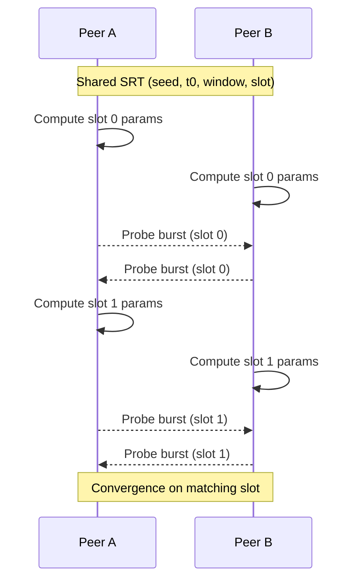

# Predictive Rendezvous: Time–Intent–Deterministic P2P Connection Establishment Without Infrastructure

## Contents
- Abstract
- Introduction
- Model
- Deterministic Schedule Function (Formalization)
- Protocol Sketch
- Diagrams
- Proof-of-Concept and Observations
- Properties
- Limitations
- Notes

## Abstract
Predictive Rendezvous is a method for establishing peer-to-peer connections using shared seeds, time windows, and deterministic schedules. Instead of relying on signaling servers, STUN/TURN, or negotiated rendezvous services, both peers independently compute the same sequence of probing slots from a Semantic Rendezvous Token (SRT). This document records the core idea, model, and properties as prior-art documentation aligned with an implemented reference design.

## Introduction
Contemporary P2P rendezvous approaches often depend on infrastructure (signaling servers, STUN/TURN, or brokered negotiation), as popularized by WebRTC/ICE. Predictive Rendezvous is a different posture: prediction instead of discovery. When peers share a compact SRT, they can deterministically execute the same schedule without any third-party coordination.

## Model
### Semantic Rendezvous Token (SRT)
An SRT is an executable rendezvous plan (not an IP address and not a room ID). It contains enough information for both peers to derive the same schedule:
- `seed`: 32-byte deterministic seed.
- `time_model`: `{ t0, window_secs, slot_ms }`.
- `identities`: allowed peer fingerprints.
- `search_strategy`: deterministic strategy selector.
- `escalation`: escalation policy selector.

### Time Model and Slots
The time model defines a rendezvous window and the slot duration. Slot index is computed as:
```
slot_index = floor((now_ms - t0_ms) / slot_ms)
```
Slots outside the `[t0, t0 + window]` interval are inactive.

## Deterministic Schedule Function (Formalization)
For each slot, both peers derive parameters from a strong PRF over:
```
seed || role_tag || slot_index
```

Inputs:
- `seed`: 32-byte seed from the SRT.
- `role_tag`: one of `Caller`, `Callee`, or `Symmetric`.
- `slot_index`: computed as `floor((now_ms - t0_ms) / slot_ms)`.

Outputs (per slot):
- `local_port_offset`: 16-bit offset.
- `remote_port_offset`: 16-bit offset.
- `burst_pattern`: 4 bytes describing the probe burst pattern.

Role tags enable asymmetric or mirrored schedules when desired.

## Protocol Sketch
1. **SRT creation**: a peer generates a seed, chooses a time window, and encodes identity constraints.
2. **Exchange**: the SRT URI is shared over arbitrary channels (chat, email, QR, NFC, etc.).
3. **Independent execution**: both peers compute slot parameters from the same SRT and current time.
4. **Probe emission**: each peer emits probes for each active slot using the derived schedule.
5. **Success detection**: a received probe is validated against the SRT (matching rendezvous ID and identity constraints). On success, higher layers establish the session.

## Diagrams
### Predictive Rendezvous slot-based coordination


### Layering (PR as coordination layer)
```mermaid
flowchart TD
    App[Application] --> PR[Predictive Rendezvous (Coordination)]
    PR --> Transport[UDP / Transport]
    Transport --> Network[Network]
    Infra[Infrastructure (optional)] -.-> PR
```

## Proof-of-Concept and Observations
A minimal proof-of-concept uses two nodes (A and B) with a shared SRT and a small window (e.g., 3–10 seconds). Each node independently computes slots and emits probes derived from the same schedule. In LAN and simple NAT scenarios, convergence is observed within a small number of slots when both nodes have candidate remote addresses. The behavior remains deterministic across repeated runs with the same inputs, and failures are primarily attributable to missing address knowledge or strict network isolation rather than schedule divergence.

## Properties
- **No servers required by design**: SRTs do not encode IPs or ports; no discovery server is required for schedule agreement.
- **Deterministic and testable**: schedules are pure functions of `(seed, time_model, role)`.
- **Compatible with prior knowledge**: peers can use historical addresses, local discovery, or user-provided hints to populate candidate remote addresses while keeping rendezvous logic deterministic.

## Limitations
- **No prior or implicit knowledge**: without any candidate remote addresses or shared rendezvous context, peers have no basis to target probes.
- **Disconnected networks**: if peers cannot reach each other’s network paths, deterministic schedules cannot overcome hard connectivity constraints.

## Notes
This document is intended as prior-art documentation and a concise conceptual description, not a full academic treatment.
